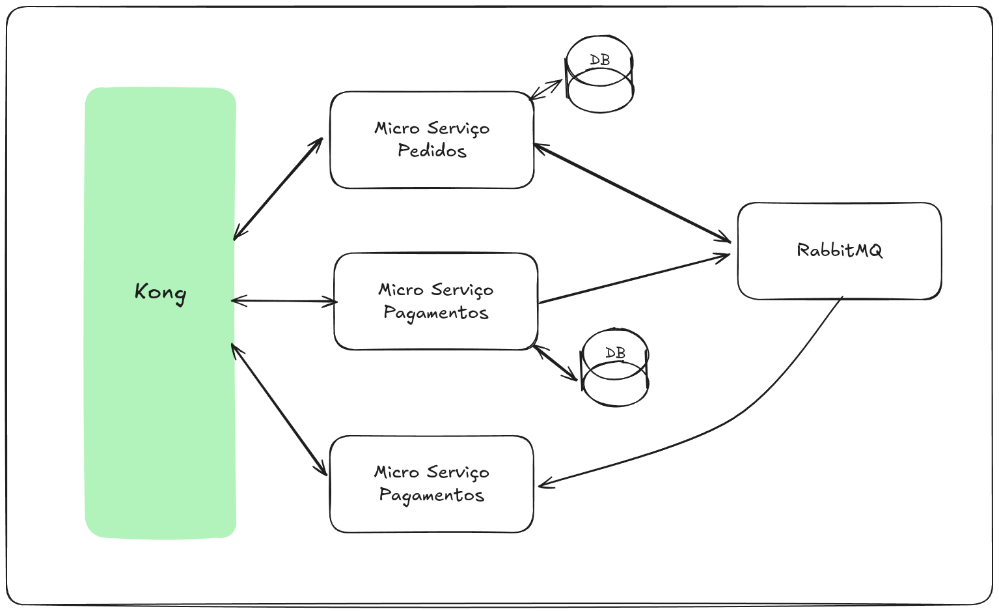
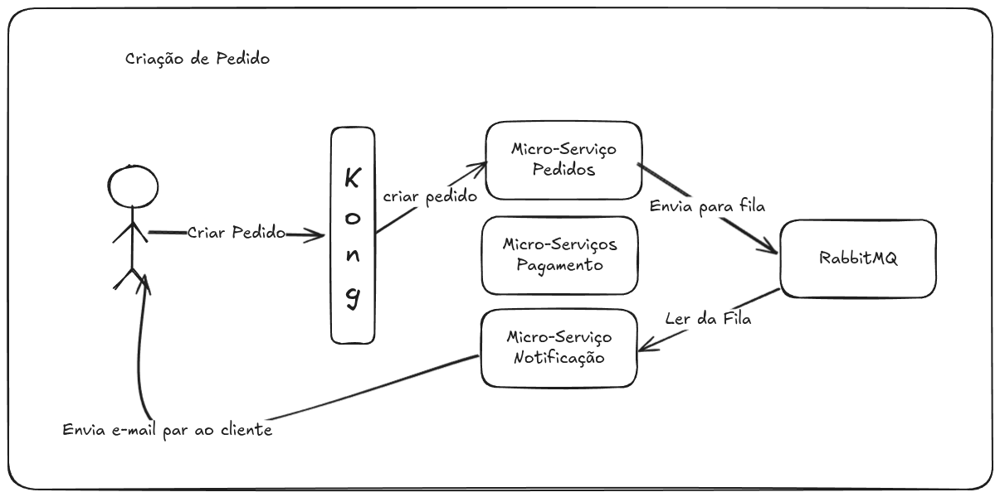
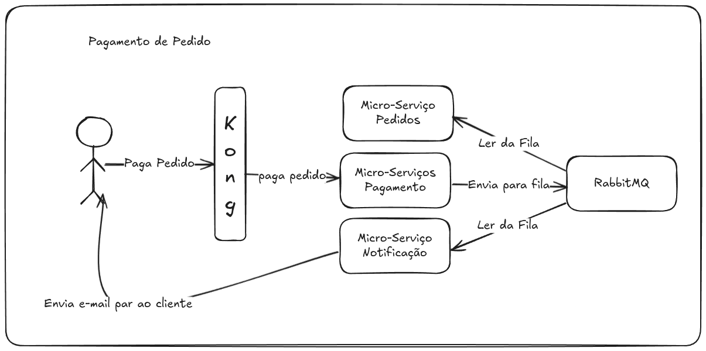
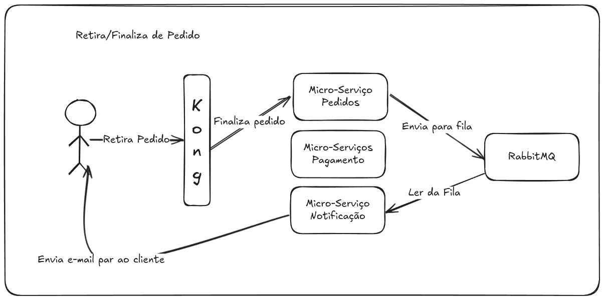

# Desafio Tech 02 - Microservices Project

This project implements a microservices architecture for managing orders, payments, and notifications.  It utilizes NestJS, Docker, and RabbitMQ for inter-service communication.

## Architecture Overview

This diagram illustrates the overall architecture of the system, showcasing the interaction between the different microservices and external components.

## Microservices

### 1. Micro-Orders

*   **Responsibility:** Manages the creation, retrieval, delivery, and payment status of orders.
*   **Technologies:** NestJS, Prisma, PostgreSQL, RabbitMQ
*   **Key Features:**
    *   Create new orders.
    *   Fetch orders by ID.
    *   Update order status (e.g., delivered, paid).
    *   Publishes events to RabbitMQ for payment and notification services.
*   **API Endpoints:**
    *   `POST /orders`: Create a new order.
    *   `GET /orders/:id`: Retrieve an order by ID.
    *   `PUT /orders/:id/deliver`: Mark an order as delivered.
*   **Consumers:**
    *   `order.paied`: Mark an order as paid.

### 2. Micro-Payments

*   **Responsibility:** Handles payment processing for orders.
*   **Technologies:** NestJS, Prisma, PostgreSQL, RabbitMQ
*   **Key Features:**
    *   Receives payment requests from the Orders service via RabbitMQ.
    *   Processes payments (mock implementation).
    *   Updates order status in the Orders service via RabbitMQ.
*   **API Endpoints:**    
    *   `POST /payments/:id/pay`: Processes a payment for a specific order.
* **Consumers:**
    *   `order.created`: Receives order creation event.

### 3. Micro-Notifications

*   **Responsibility:** Sends notifications to users regarding order updates (e.g., order created, order delivered).
*   **Technologies:** NestJS, RabbitMQ
*   **Key Features:**
    *   Receives order events from the Orders and Payments services via RabbitMQ.
    *   Sends email notifications (mock implementation).
*   **Consumers:**
    *   `order.created`: Receives order creation event.
    *   `order.deliveried`: Receives order delivered event.
    *   `order.paied`: Receives order paid event.

## Workflow

### 1. Order Creation

This diagram illustrates the flow for creating a new order. The user initiates an order through the API Gateway, which forwards the request to the Micro-Orders service. The Micro-Orders service creates the order and publishes an event to RabbitMQ.

### 2. Payment Processing

This diagram illustrates the payment processing flow. The Micro-Payments service receives the payment event from RabbitMQ, processes the payment, and updates the order status in the Micro-Orders service.

### 3. Order Fulfillment

This diagram illustrates the order fulfillment flow. The Micro-Orders service updates the order status to "delivered", which triggers a notification to the Micro-Notifications service.

## Getting Started

1.  Clone the repository: `git clone https://github.com/dornelles08/desafio-tech-02.git`
2.  Navigate to the project directory: `cd desafio-tech-02`
3.  Build and run the services using Docker Compose: `docker-compose up --build`

## Dependencies

*   Docker
*   Docker Compose
*   Node.js
*   NestJS
*   Prisma
*   PostgreSQL
*   RabbitMQ

## Contributing

Contributions are welcome! Please feel free to submit pull requests.

## License

This project is licensed under the MIT License.
